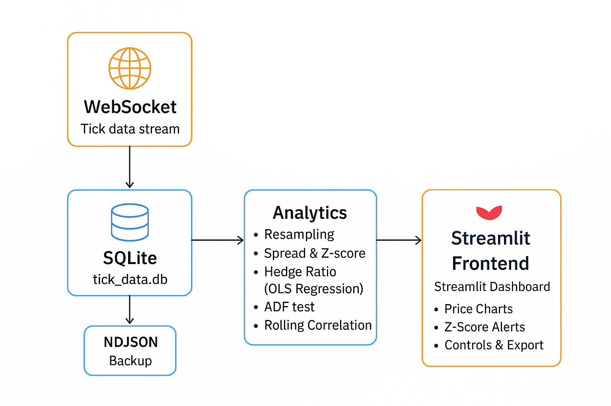

# 📊 Quant Developer Assignment — Duddukuri Kurumurthy

## 🎯 Objective
Develop a **real-time analytical dashboard** that reads **Binance tick data** (via WebSocket and NDJSON), processes it, performs **quantitative analytics**, and visualizes the results interactively using **Streamlit**.

---


## 🧱 Architecture Diagram


---

## 🧩 Components
| Component | Description |
|------------|-------------|
| **Frontend** | Streamlit interactive dashboard |
| **Backend** | Python — Pandas, NumPy, Statsmodels, SQLite |
| **Data Source** | Binance WebSocket (live ticks) + Local NDJSON backup |
| **Database** | SQLite (`tick_data.db`) for live tick storage |
| **Visualization** | Plotly charts — Prices, Spread, Z-Score, Correlation |
| **Analytics** | Spread, Hedge Ratio (OLS), ADF Test, Rolling Correlation, Z-Score |
| **Alerts** | BUY/SELL signals based on Z-Score |
| **Extras** | Mean-Reversion Trading Logic, Auto Refresh, Data Export (CSV) |

---

## 🧠 Methodology

1. **Data Ingestion**
   - Stream real-time Binance data using WebSocket.
   - Store live ticks in `tick_data.db` using SQLite.
   - Alternatively load historical NDJSON tick data.

2. **Resampling**
   - Aggregate data into `1S`, `1T`, or `5T` intervals.

3. **Analytics**
   - `Spread = Price(S1) - Price(S2)`
   - Hedge Ratio via **OLS Regression**
   - Rolling Mean, Std, and Z-Score
   - **ADF Test** for stationarity
   - Rolling Correlation between pairs

4. **Visualization**
   - Plotly charts for:
     - Price Comparison  
     - Spread and Z-Score  
     - Rolling Correlation  

5. **Trading Logic**
   - Generate BUY/SELL/Neutral signals based on **Z-score** thresholds.

6. **Export**
   - Download processed analytics as CSV.

---

## 🧭 Mean-Reversion Trading Logic

| Condition | Signal |
|------------|---------|
| z-score > +2 | 🔴 **SELL Signal** — Overbought condition |
| z-score < 0 | 🟢 **BUY Signal** — Mean reversion (oversold) |
| otherwise | ⚪ **Neutral Zone** — No strong trading signal |

---

## 🧮 Example Analytics
| Metric | Description |
|---------|--------------|
| **Spread** | Price difference between selected symbols |
| **Z-Score** | Statistical deviation from rolling mean spread |
| **Hedge Ratio** | Regression coefficient (OLS slope) |
| **ADF p-value** | Stationarity test result |
| **Rolling Correlation** | Dynamic correlation trend over rolling window |

---

## 📡 Data Source Modes

| Mode | Description |
|------|--------------|
| 🗄️ **Live Database** | Streams live Binance tick data stored in `tick_data.db` |
| 📁 **NDJSON File** | Loads previously saved tick data from `.ndjson` |

> 💡 The app auto-refreshes live data every few seconds when **Live Database** mode is selected.

---

## 🧰 Requirements

Install required libraries before running:

```bash
pip install streamlit pandas numpy plotly statsmodels streamlit-autorefresh


## ▶ How to Run the App (Single Command)

```bash
cd D:\django\Quant_Project
venv\Scripts\activate
python app.py


---

## 🤖 ChatGPT Usage Transparency

ChatGPT was used to assist with:
- Structuring and optimizing Streamlit and WebSocket integration.
- Improving documentation clarity and formatting.
- Debugging ADF, OLS, and auto-refresh logic.

All **core logic, data handling, and validation** were implemented, tested, and verified manually by **Duddukuri Kurumurthy**.


---

## 📽️ Demo Video
A short walkthrough of the live dashboard is available below:
[▶ Watch the demo](demo.mp4)
